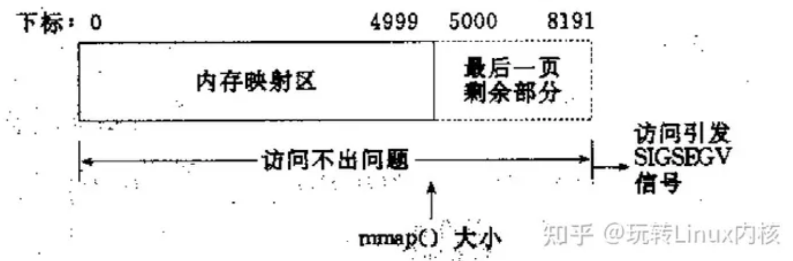
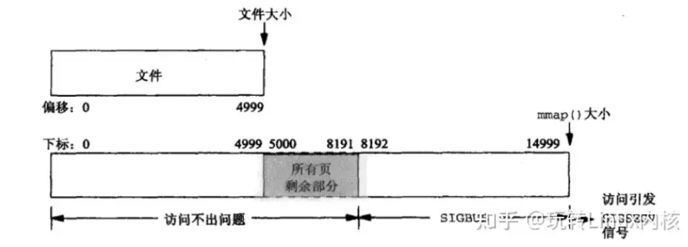

## 1GB大小的文件，用mmap映射成2GB，并在2GB的末尾写入几个字节，会发生什么？

现在有这样一个场景：如果有一个1GB大小的文件，现在用mmap将他映射成2GB，并且在2GB的末尾写入几个字节，那么请问这个文件现在有多大？在磁盘上的分布是怎样的？

或许我们可以写个程序尝试一下
```c
#include <stdio.h>
#include <stdlib.h>
#include <sys/mman.h>
#include <sys/stat.h>
#include <fcntl.h>
#include <unistd.h>

#define INITIAL_SIZE 1024   // 1KB
#define MAP_SIZE     4096   // 4KB

int main() {
    const char *filename = "testfile.bin";
    int fd = open(filename, O_RDWR | O_CREAT, 0666);
    if (fd < 0) {
        perror("open");
        exit(EXIT_FAILURE);
    }
    
    // 将文件大小设置为 1KB
    if (ftruncate(fd, INITIAL_SIZE) == -1) {
        perror("ftruncate");
        close(fd);
        exit(EXIT_FAILURE);
    }
    
    // 将文件映射到 4KB 的地址空间
    void *map = mmap(NULL, MAP_SIZE, PROT_READ | PROT_WRITE, MAP_SHARED, fd, 0);
    if (map == MAP_FAILED) {
        perror("mmap");
        close(fd);
        exit(EXIT_FAILURE);
    }
    
    // 在映射区域的最后一个字节处写入数据
    char *p = (char *)map;
    p[MAP_SIZE - 1] = 'A';  // 写入字符 'A'
    
    // 同步修改到磁盘（可选步骤，保证数据写入磁盘）
    msync(map, MAP_SIZE, MS_SYNC);
    
    // 解除映射并关闭文件
    if (munmap(map, MAP_SIZE) == -1) {
        perror("munmap");
    }
    close(fd);
    
    // 使用 stat 获取最终文件的逻辑大小
    struct stat st;
    if (stat(filename, &st) == -1) {
        perror("stat");
        exit(EXIT_FAILURE);
    }
    printf("最终文件大小：%ld 字节\n", st.st_size);
    
    return 0;
}
```

这段代码输出的文件大小仍然是 1024 字节。很显然，我们在mmap映射后的虚拟地址写入的字节并没有真正的落盘，文件大小也没有被真正的扩展。

如果我们此时想读出写入的最后一个字节
```c
// 读取并打印映射区域的最后一个字节
    char last_byte = p[MAP_SIZE - 1];
    printf("映射区域的最后一个字节：%c\n", last_byte);
```
发现什么都不会打印，并且也不会报错。

### mmap中的对齐操作
在mmap当中，有一个需要注意的关键点：mmap的映射区域必须是物理页大小的整数倍（因为内存的最小粒度就是页，而进程虚拟地址空间和内存映射也是以页为单位的）。如果说我们使用mmap时设置的映射区域不是页的整数倍，mmap会暗中将区域进行自动扩展，扩展的部分用零填充。

#### 一个文件大小是5000字节，mmap5000字节到虚拟内存中
物理页面大小是4096字节，所以虽然说被映射的文案近只有5000字节，但是mmap函数执行后，实际映射到虚拟内存区域的有8192个字节，其中5000～8192的字节部分用零填充。


此时：

（1）读/写前5000个字节（0~4999），会返回操作文件内容。

（2）读字节50008191时，结果全为0。写5000-8191时，进程不会报错，但是所写的内容不会写入原文件中 。

（3）读/写8192以外的磁盘部分，会返回一个SIGSECV错误。

#### 一个文件大小是5000字节，mmap15000字节到虚拟内存中（本文的起源！！！）
文件大小是5000字节，对应两个物理页。那这两个物理页都是合法读写的，但是超出5000的部分不会体现在原文件中。由于要求映射15000字节，而文件只占两个物理页，因此8192字节~15000字节都不能读写，操作时会返回异常。


此时：

（1）进程可以正常读/写被映射的前5000字节(0~4999)，写操作的改动会在一定时间后反映在原文件中。

（2）对于5000~8191字节，进程可以进行读写过程，不会报错。但是内容在写入前均为0，另外，写入后不会反映在文件中。

（3）对于8192~14999字节，进程不能对其进行读写，会报SIGBUS错误。

（4）对于15000以外的字节，进程不能对其读写，会引发SIGSEGV错误。

所以，针对本文讨论的问题，答案应该是 **文件大小因为没有被显示扩展所以大小不会改变（mmap无法自动扩展文件大小）仍然是1GB，同时我们写入2GB的末尾也不会报错，但是内容只会被写入到页缓存（page cache）中，并不会反映到源文件中，也不会同步到磁盘**。

msync会将页缓存的修改同步到磁盘，但若文件未扩展，同步的范围仍受限于文件逻辑大小，因此超出部分的修改会被丢弃。