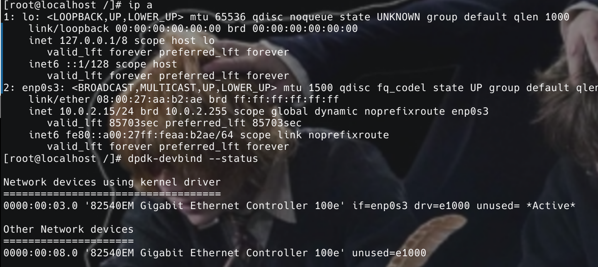
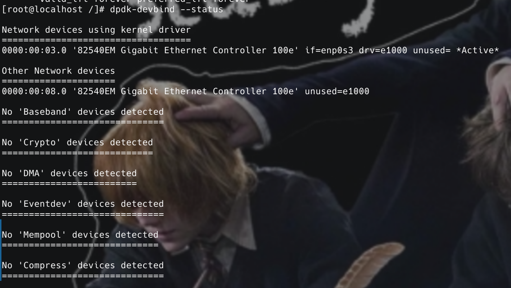
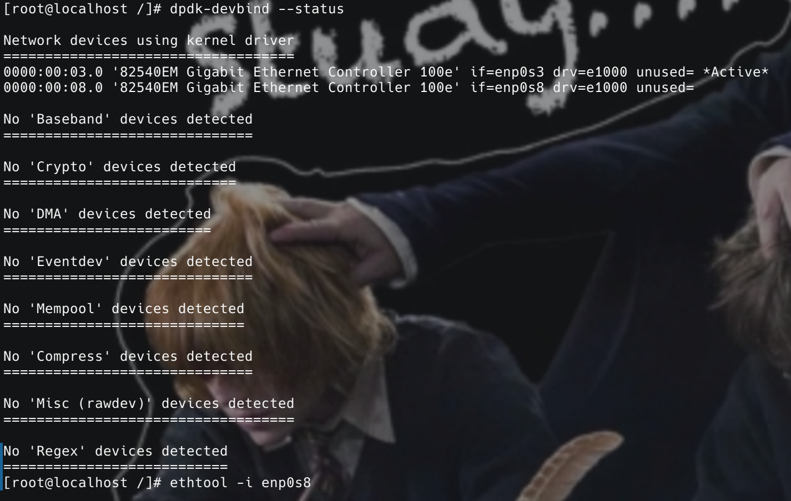

## 记录gazelle项目遇到的问题

### 解绑dpdk

1.首先查看当前网络中所有网络接口的ip地址

```
ip a
```



可以看到图中只存在1和2

2.`dpdk-devbind --status`查看当前设备状态



`enp0s3` 是使用内核驱动程序，而`0000:00:08.0`使用其他，用`dpdk-devbind -u 0000:00:08.0`解绑并使用`dpdk-devbind -b e1000 0000:00:08.0`重新绑定回内核程序

3.继续使用`dpdk-devbind --status`查看当前设备状态



发现`0000:00:08.0`成功使用内核驱动程序，但是用`ip a`命令发现没有对应的ip


4.给此接口绑定ip：`ip addr add 172.17.0.3/16 dev enp0s8`


成功！