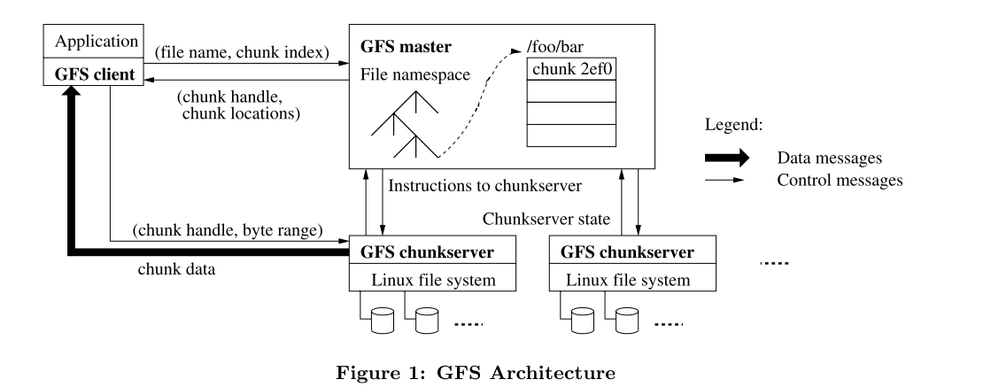

## GFS

GFS 是谷歌开发的分布式文件系统，主要用于提供一个基于众多廉价服务器工作的基础层分布式文件存储服务。是 Google 三驾马车中最底层的组件。他认为
- 使用的机器是廉价的商业化机器，所以崩溃是一种常态
- 主要存储大文件，也支持小文件
- 需要支持大规模的连续读和小规模的随机读，以及大规模的追加写
- 能在分布式系统上运行
  
### GFS 的基本框架
一个 GFS 集群包含单个 master 和多个 chunkserver。master 节点负责两点，一是 **存储和维护 chunkserver 和数据块的相关信息**，二是 **处理客户端的请求**。也就是说 master 节点并不存储任何具体的数据，这些数据被存在chunkserver的数据节点上。其中chunk就是数据块，在GFS中固定为64MB。**每当数据需要被写入，会更新GFS的信息，并把数据封装成chunk写入到数据库中**。

上图展示了GFS进行读操作的流程
- 应用首先调用GFS Client函数，读取具体的文件/foo/bar,假设大小为50MB
- client 根据 chunk的固定大小计算/foo/bar的chunk的index,即64/50向上取整，Chunk Index=1。以及其在Chunk内的偏移量Byte Range[0，50]，并将File Name和Chunk Index作为参数发送给GFS Master
- Master返回了对应的Chunk Handle（也就是Chunk的ID，上图中的2ef0）和Chunk Locations（Chunk Server和其副本的IP）
- GFS Client根据返回的Chunk Locations找到最近的Chunk Server，然后根据Chunk Handle找到对应的Chunk，最后按照这个文件在Chunk中偏移量Byte Range读取文件。
- Chunk Server按照其要求返回文件数据。

客户端负责将文件在File Namespace的位置交给Master，Master根据其位置返回对应的Chunk和Chunk Server，然后客户端再根据这些信息去拿数据

#### master
master节点中需要保存三种信息，这些信息都存储在内存当中
- 文件和chunk的namespace（文件树的命名方式）
- 文件到chunk的映射（每个文件需要几个chunk来记录）
- 每个chunk的具体位置
  
前两种还会持久化保存，存储在master本地磁盘和远程机器上。chunk的位置会在master启动时或者周期性的向所有chunkserver获取并更新。

### 容错机制
#### master的容错：操作日志+checkpoint+shadowmaster

master每次更新元数据都需要先写操作日志（WAL），持久化到本地磁盘并拷贝到多个远程机器，才启动真正的写操作。

为了避免日志过大导致启动缓慢，master会定期回收日志，原理是将当前内存状态冻结并持久化存储到磁盘上，称为checkpoint。然后，会回收之前的日志。若系统此时重启，只需要将Checkpoint加载入内存后.重放Checkpoint点之后的日志即可在内存中重构最新状态。

设置shadow master,持续地读取某个master副本的操作日志，并重放到自己内存，保持与master一致；如果master宕机仍然可以提供可读访问。

#### chunkserver的容错机制：复制多个副本+checksum
为了确保可靠性，每个chunk在多个chunkserver上创建副本（默认三份）。

每个chunk被分成多个64KB的块，每个块对应一个32位的checksum,保存在内存中。读取块副本时，chunkserver会将读取的数据与校验和进行比较，如果不匹配会向客户端返回错误。客户端会向其它副本重试读请求，master会尽快从其他副本克隆数据创建新的chunk；当新克隆的副本就绪，master会命令发生错误的chunkserver删除异常副本，保证集群数据完整性。

